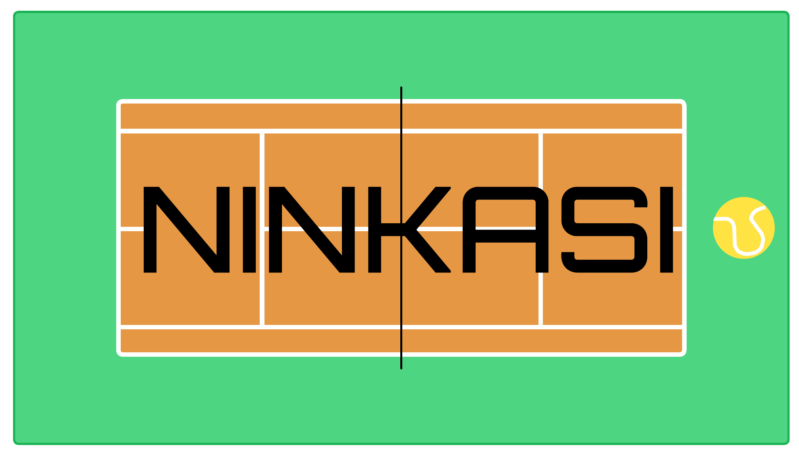
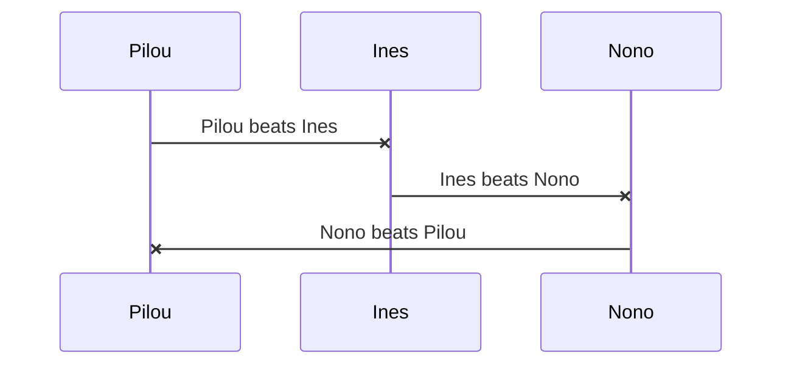
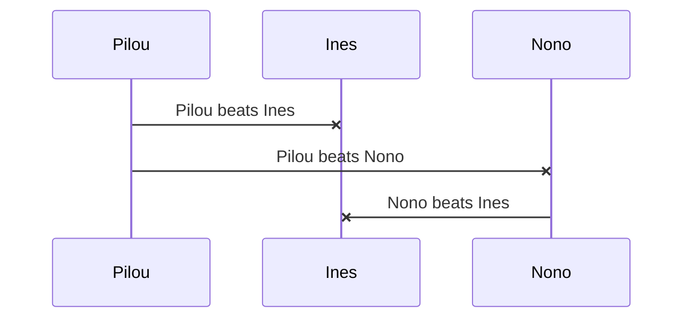
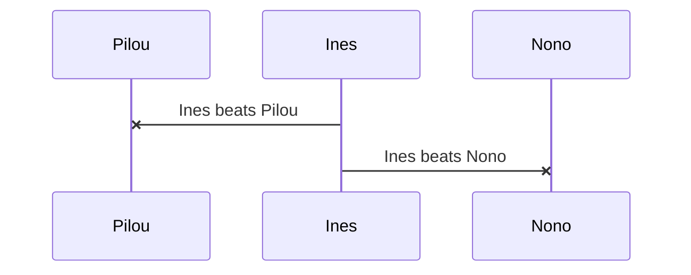

      
      
<em></em>

# Game Rules 
Ninkasi is a three‑player variant of rock‑paper‑scissors that uses tennis scoring. 
A match is played over one or more sets, each consisting of six games. In each game, all three players engage in consecutive rounds of shi fu mi until one of them reaches and wins the “AV” point. The winner of the game earns one game point. The first player to win six games with at least a two‑game lead over both opponents wins the set.
## Games
Each game is made up of several consecutive rounds of shi fu mi. 
Whenever a player wins a round, their score advances according to the tennis sequence: 0 → 15 → 30 → 40 → AV. If a player reaches AV and then wins another round before any other player has reached AV, the game ends immediately and they score that game point. However, if two or more players are at AV simultaneously such as in this game state :

| Score | Pilou | Ines | Nono |
|:-----:|:-----:|:----:|:----:|
| 15    |       |      |     |
| 30    |      |     |     |
| 40    |       |   ✔  |      |
| AV    |   ✔    |      |  ✔    |

Then particular rules apply. Let's see all of the possible outcomes : 
* If either Pilou or Nono wins without the other winning then the player that did not win the round loses the AV.

| Score | Pilou | Ines | Nono |
|:-----:|:-----:|:----:|:----:|
| AV    |  ✖✔     |      |  ✔    |

* If both Pilou and Nono win a point, or if they both lose then nothing happens 

| Score | Pilou | Ines | Nono |
|:-----:|:-----:|:----:|:----:|
| AV    |    ✔    ||  ✔    |

* If Pilou wins two points (i.e by beating Ines and Nono) and Nono does not win a point then the game ends and Pilou gets a point for the set currently in play. The first point makes Nono lose his AV and the second point makes Pilou win the game. 

| Score | Pilou | Ines | Nono |
|:-----:|:-----:|:----:|:----:|
| AV    |    👑    || ✖✔   |

* If Nono wins two points (i.e by beating Ines and Pilou) and Pilou also wins (by beating Ines) then the game state becomes the same as for the first rule, as Noah having won one more time than Pilou makes him lose his AV.

| Score | Pilou | Ines | Nono |
|:-----:|:-----:|:----:|:----:|
| AV    |    ✖✔   |      |  ✔    |

While all of this is happening Ines can catch up to the other two players and have the AV. If that happens then the rules above apply but for three players. If two or more rules overlap then how the points are counted is kept to the discretion of all the players. 
## Some Exemples :
Let's now present some exemples
#### First Example :

```mermaid
sequenceDiagram
participant Pilou
participant Ines
participant Nono
    
Pilou-x Ines: Pilou beats Ines
Ines-xNono: Ines beats Nono
Nono-x Pilou: Nono beats Pilou

```
The game state then becomes :

| Score | Pilou | Ines | Nono |
|:-----:|:-----:|:----:|:----:|
| 15    |    ↓   |      |   ↓   |
| 30    |   ✔   |  ↓    |   ✔  |
| 40    |       |   ✔  |      |
| AV    |       |      |      |

#### Second Example

```mermaid
sequenceDiagram
participant Pilou
participant Ines
participant Nono
    
Pilou-x Ines: Pilou beats Ines
Pilou-xNono: Pilou beats Nono
Nono-x Ines: Nono beats Ines

```
The game state then becomes :

| Score | Pilou | Ines | Nono |
|:-----:|:-----:|:----:|:----:|
| 15    |       |      |      |
| 30    |      |    ✔   |     |
| 40    |    ✔   |     |    ✖✔    |
| AV    |       |      |      |

Notes : Nono loses his AV

#### Third Example

```mermaid
sequenceDiagram
participant Pilou
participant Ines
participant Nono
    
Ines-x Pilou: Ines beats Pilou
Ines-xNono: Ines beats Nono

```
The game state then becomes :

| Score | Pilou | Ines | Nono |
|:-----:|:-----:|:----:|:----:|
| 15    |       |      |      |
| 30    |      |    ↓   |     |
| 40    |   ✖ ✔   |  ✔   |    ✖✔    |
| AV    |       |      |      |

Notes : Both Pilou and Nono lose their AV
